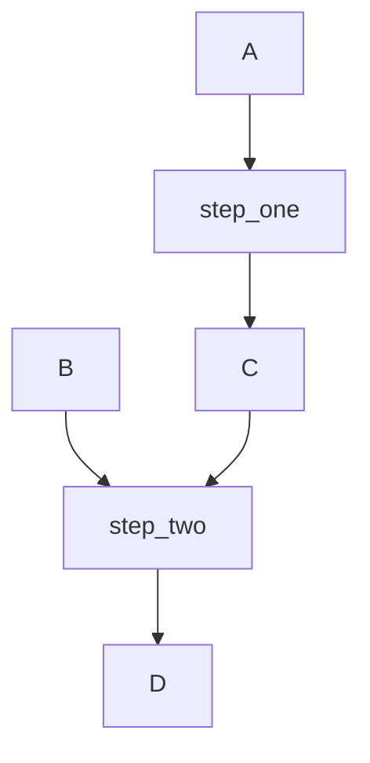
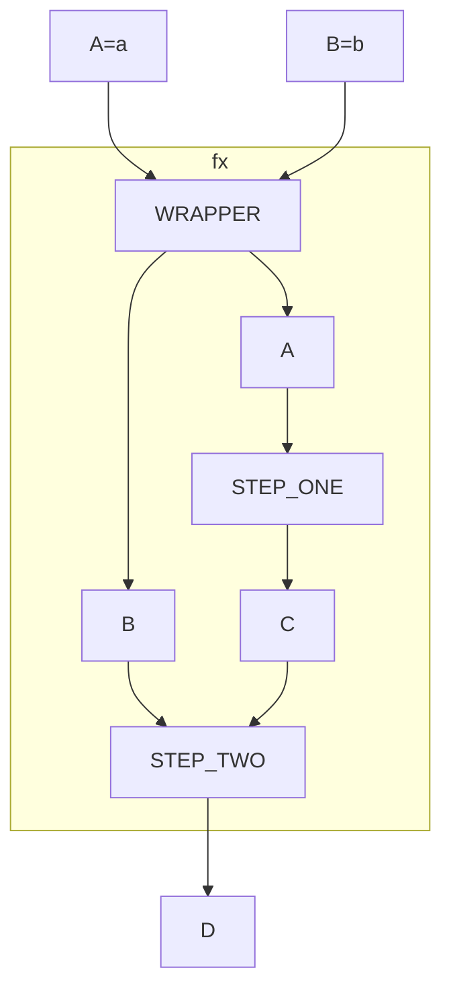
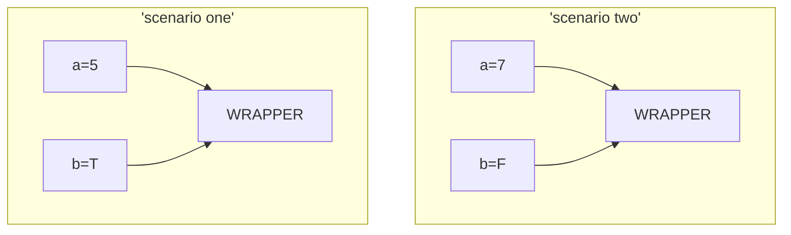

<div class = "uk-container uk-container-small">

-----------------------

* TOC
{:toc}

-----------------------

<br>


## Functions

Revisit the following chapter from last semester:

[Functions](http://ds4ps.org/dp4ss-textbook/ch-040-functions.html)

Make sure you are clear about: 

* Arguments 
* Object assignment (arrow) versus argument assignment (equals) 
* When are quotation marks needed around arguments? 
* Single-value arguments (one number or string) versus compound arguments (use `c()` or pass existing objects)  
* Argument defaults
* Explicit and implicit use of argument names and positions 
* Return values in R 
* Function scope 

```r
###  data recipe to convert celsius to fahrenheit

temp.in.celsius <- 100
temp.in.fahrenheit <- ( temp.in.celsius * 9/5 ) + 32
temp.in.fahrenheit  # print the new temp  
[1] 212
  
### repackage the recipe as a function

celsius_to_fahrenheit <- function( temp.in.celsius=100 )
{
  temp.in.fahrenheit <- ( temp.in.celsius * 9/5 ) + 32
  return( temp.in.fahrenheit )
}
                       
celsius_to_fahrenheit( 100 )  # test the function 
[1] 212

# if we don't provide a temperature 
# the function uses the DEFAULT ARGUMENT VALUE provided: 
# temp.in.celsius=100
  
celsius_to_fahrenheit( )  
[1] 212

# if we provide a temperature it replaces the default value

celsius_to_fahrenheit( 38 )
[1] 100.4

# EXPLICIT use of arguments requires the name: 

celsius_to_fahrenheit( temp.in.celsius=38 )
[1] 100.4
  
# IMPLICIT use of arguments requires position only
# (we only have one argument here so position doesn't matter
#  but you get the idea):  

celsius_to_fahrenheit( 38 )
[1] 100.4
```
  

## Input-Output Machines: Arguments and Returns 

Functions are input, output machines. 

* Arguments are the inputs.
* The object sent back to the user via the return() call is the output. 

```r
add_these <- function ( x, y )
{
  sum.xy <- x + y 
  return( sum.xy )
}

add_these( x=2, y=3 )
> 5
```

<br> 

### Arguments as Slots

We often use functions as a part of a workflow. In these cases we will be sending objects instead of values to the functions.

It's important to keep two things clear - the difference between ARGUMENTS and OBJECTS. To use an algebra example, the arguments are like the variable X, a placeholder that can take on any value. Currently it is holding the value of 7:

```
x = 7
```

But in your code you have an extra layer - the **object a** has been assigned the value 2. The value 2 is then assigned to **argument A** when **object a** is passed to the function at `sum( A=a )`. 

```r
sum <- function( A, B ) {
  sum.ab <- A + B 
  return( sum.ab )
}

a <- 2
b <- 3
sum( A=a, B=b )
> 5
```

Conceptually we are passing the value **2** to **argument A** through **object a**. 

```
A <- a <- 2
```

Note that argument assignment uses the equal sign while object assignment uses the arrow, but the value being passed is always on the right, and the variable receiving the value is on the left. 

```r
sum( A=a )  # equivalent to:  A <- a
```

Since functions are general purpose machines we can pass any numeric value to argument A and it will sum it with B to get the result. As a result, **an argument is a placeholder for whichever value you pass**. 

Think of it as the hole carved in the box and the values are the actual pieces that we put into the holes: 

 

The function itself should only use information passed through arguments.  

```r
function( ??? ) {
  X + Z 
}
```

Always check that your argument names match the variables used inside the function.

```r
function( A, B ) {  # incorrect
  X + Z 
}

function( X, Z ) {  # correct
  X + Z 
}
```

<br> 

### Workflow

A workflow is a framework that lets us execute a consistent data recipe but easily change inputs. Specifically, workflows use chaining where the output from one function serve as the input into a subsequent function. 

For example, A and B might be the raw inputs into the workflow. C is created from A at step_one(), so it is not an input into the workflow - it is a byproduct:

```r
# A -> f() -> C
step_one <- function( A )
{ 
  C <- function(A)   # use input A to create output B
  return(C) 
} 

# B, C -> f() -> D
step_two <- function( B, C )
{ 
  D <- B + C 
  return(D) 
}
```

The flow of objects through the process would look something like this: 



We can package the entire recipe using a wrapper function that requires all of the inputs. Note that C is not required since it's created inside the workflow from A: 

```r
wrapper_function <- function( A, B ) {
  C <- step_one( A )
  D <- step_two( B, C )
  return( D )
}
```

.


 
This allows us to re-use our data recipes easily by changing the input values. 

```r
a <- 7
b <- FALSE 
wrapper_function( A=a, B=b )

a <- 5
b <- TRUE 
wrapper_function( A=a, B=b )
```  
  


  
**TIP:** Pay attention to the difference between object names and argument names in the first lab. 

You will create a game setup (a car behind one door and goats behind two others), and randomly select a door. 

The game setup and the first door selection are then passed to the next function: 

```r
my.game     <- create_game()
first.pick  <- select_door()
opened.door <- open_goat_door( game=my.game, pick=first.pick )

# ARGUMENT ASSIGNMENT HERE EQUIVALENT TO:
#   open_goat_door( game=my.game, pick=first.pick )
#   game <- my.game 
#   pick <- first.pick

# THE WORKFLOW IS CONCEPTUALLY:
#   game <- my.game <- create_game()
#   pick <- first.pick <- select_door()
```  
  
```mermaid 
graph TD;
  id1([CREATE_GAME])  --> my.game;
  id2([SELECT_DOOR])  --> first.pick;
  my.game --> GAME=my.game;
  first.pick --> PICK=my.pick;
  subgraph fx
  GAME=my.game --> id3([ OPEN_GOAT_DOOR ]);
  PICK=my.pick --> id3([ OPEN_GOAT_DOOR ]); 
  end
  id3([ OPEN_GOAT_DOOR ]) --> opened.goat.door; 
```


<br> 

## Function Scope

The other rule you need to remember when converting a data 'recipe' (a working linear script) to a function, you need to figure out ALL arguments needed for the function to compute everything properly. It should ONLY rely on information you give to the function directly as arguments and NOT rely on information that is in the global environment: 

```r
#  BAD !!!
y <- 10                      # y is in the global environment
add_these <- function ( x )  # x is explicitly passed to the function
{
  sum.xy <- x + y
  return( sum.xy )
}

add_these( x=5 )  # will compute be cause when it can't find an 
> 15              # argument y it looks in the global environment
```

```r
#  GOOD
add_these <- function ( x, y=10 )
{
  sum.xy <- x + y
  return( sum.xy )
}

add_these( x=5 )   # computes because y has a default argument value,
> 15               # but does not rely on info outside of the function
```

They look similar, but the first version assumes that Y will always be defined somewhere in the script. It breaks the rule of functions being self-contained. All variables referenced inside a function should be passed to the function as argument. 

There are good reasons to break the rule sometimes, but in general your workflow will produce less errors if you follow that principle. 
Many people are familiar with the expression "What happens in Las Vegas stays in Vegas."

Scope is the rule that "what happens inside of functions stays inside of functions". 

It is very common to use variables like **X** or **dat** to represent objects in R. This has the potential to create conflicts where one X is over-written when a new X is created later on in the code. 

Specifically, if you have defined X in your script, then you call a function that uses X, how does R manage the conflict of having two objects X active at the same time? 

```r
x <- 10 

two.plus.two <- function()
{
  x <- 2 + 2
  return( x )
}

two.plus.two()    # calls:   x <- 2 + 2
[1] 4
  
x       # our original X was protected from X inside the function
[1] 10
```

Scope prevents actions inside of a function from impacting your active work environment. 

Note that the function **two.plus.two()** returns the object **x**, but after calling the function it does not replace the object **x=10** that is active in the main environment. The function is returning values held by the variable X, but not exporting the object X itself. 

In order to replace the X that is active in the environment, you need to assign the function results to the object. 

```r
# We use X to store the original name and also 
# as a variable inside the function, so there
# is a possible conflict. 

x <- "iNiGo MoNtoyA"

fix_names <- function( x )
{
  x <- toupper( x )
  return( x )
}

 
# If we call the function will it
# overwrite the original X?     

# Call the function and print the results
     
fix_names( x )  
[1] "INIGO MONTOYA"

# Now check the original X: 
# the function did not change the original value
# because of function scope - the variable X inside 
# the function does not interfere with the  
# object X in the global environment 
# (what happens inside functions stays inside functions) 
      
x
[1] "iNiGo MoNtoyA"   

# Replace the original X by assigning the 
# function results back to the object: 
# now the change is permanent 

x <- fix_names( x )
x
[1] "INIGO MONTOYA"
```

You need to be familiar with the general concept of **scope** (what happens inside functions stays inside functions), but only at a superficial level for now. 

For more details see: [Scoping Rules of R](https://bookdown.org/rdpeng/rprogdatascience/scoping-rules-of-r.html).


## Return Types and Workflows  

One of the important considerations is what type of object you want to return. 

Your function can return a single value:

```r
add_these <- function ( x, y )
{
  sum.xy <- x + y 
  return( sum.xy )
}

add_these( x=2, y=3 )
> 5
```

It can return a vector: 

```r
scale_it <- function( x, a )
{
  y <- x + a
}

scale_it( x=c(1,2,3), a=5 )
> 6, 7, 8
```

Or it can return a data frame (see example below). 

It will depend entirely on how it fits into the work flow. 

```r
# vectorized version -
#   input is a vector 
#   return object is a vector

get_first_name <- function( x )
{
  first.n <- # parse(x) code here
  return( first.n )
}

get_first_name( x=c("mary thompson","john denver") )
> "mary" "john"

# how it fits into a workflow:
#  input is the full names
#  output is first names only

d$first.name <- get_first_name( d$full.name )
```

Geocoding example with a data frame as an input and a data frame as an output: 

**address data frame: df.address**:
- id
- street
- city
- state


**fields produced by geocoding address:**
- id
- latitude
- longitude
- fips geoid

The input and output of geocode_addresses() are both data frames. 

```r
# data frame example: 
#   geocoding requires multiple vectors (address fields)
#   return object is a new data frame

geocode_addresses <- function( df.address ) 
{
  str <- df.address[["street"]]
  cty <- df.address[["city"]]
  st  <- df.address[["state"]]
  df.geo <- # geocode( str, cty, st ) code here 
  return( df.geo )
}

# how it might fit into a workflow
# create a subset data frame with address fields: 

df.address <- select( df, id, street, city, state )   
df.geo     <- geocode_addresses( df.address )

# add geo coordinates back to the original data frame:

df <- merge( df, df.geo, by="id", all.x=T )
```

The important details is you can only return **one** object from a function in R, so if your function produces several things that you need (three distinct useful columns of data in this example - latitude and longitude coordinates, along with geographic fips ID codes), then they need to be bundled together to send them all back to the user.  In this case it is done by combining the vectors into a single data frame. You can also return lists and other object types - you will learn more about those data types later in the semester. 

In general vectorized functions are easier to write and maintain. Use data frames when you are returning a full dataset instead of a single value or vector.

There is a lot of flexibility. You can mix the types: 

```r
# send vectors as inputs, return data frame

geocode_addresses <- function( str, cty, st ) 
{
  df.geo <- # geocode( str, cty, st ) code here 
  return( df.geo )
}
```

You can also decide on which parts of the workflow is handled by the function and which parts are managed by data steps outside of the functions. For example, this choice might improve the workflow by eliminating the need to merge after returning the geo data frame: 

```r
# pass full data frame, no subset by address
geocode_addresses <- function( df ) 
{
  str <- df[["street"]]  # use only columns you need
  cty <- df[["city"]]
  st  <- df[["state"]]
  df.geo <- # geocode( str, cty, st ) code here 
  df <- merge( df, df.geo, by="id", all.x=T )
  return( df )  # return full data frame
}

# how it might fit into a workflow:
#   returns same data frame, but with lat, lon, and fips appended;
#   more streamlined

df <- geocode_addresses( df )
```


  


<br>
<hr>
<br>
<br>

</div>
