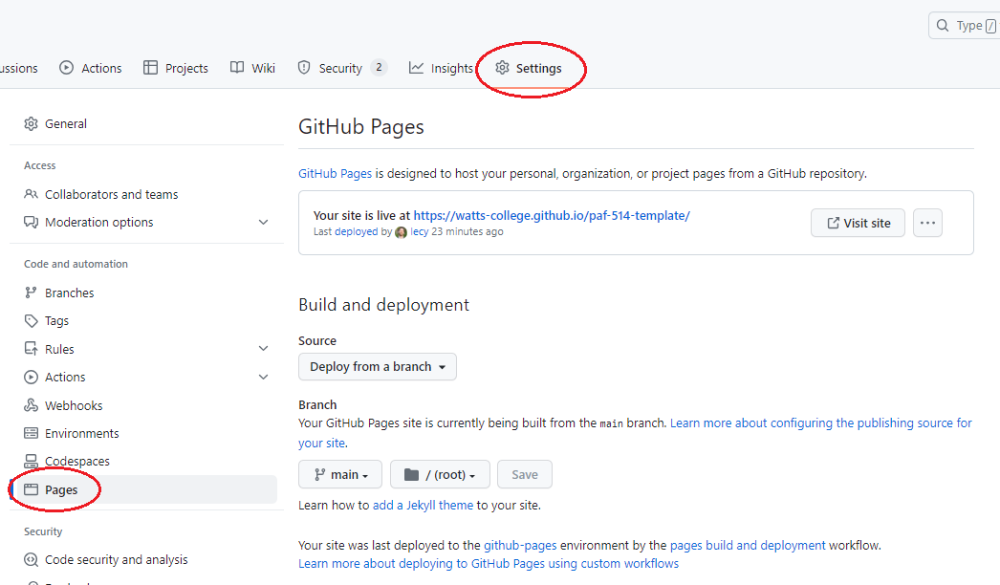

<div class = "uk-container uk-container-small">

-----------------------

* TOC
{:toc}

-----------------------

<br>
  
## Required Reading

Skim the following chapters, reading to get a general sense of **concepts, vocabulary, and the basics** of each component. *You can skip sections that explain the code in detail.* 
  
I am more concerned that you understand how these basic pieces fit together, and when you hear terms like "responsive" you conceptually know what people are talking about. At a minimum you should understand the bulleted vocabulary under each section:

[Basic Webpage Architecture](https://github.com/Watts-College/paf-514-template/raw/main/articles/html-css-basic-web-pages.pdf)

* tags (headings, formatting, lists)
* page elements (head, body) 
* structure versus presentation 
* line breaks 
  
[Style Sheets: CSS](https://github.com/Watts-College/paf-514-template/raw/main/articles/html-css-intro-to-style-sheets.pdf)

* style tags 
* properties 
* values 
* units of measure (pixels **px** versus relative scaling **EM**) 
* principle of cascading style and style hierarchy 
  
[Responsive Design](https://github.com/Watts-College/paf-514-template/raw/main/articles/html-css-responsive-design.pdf)

* screen size (desktop vs mobile vs tablet) 
* containers 

[Bootstrap (wikipedia entry)](https://en.wikipedia.org/wiki/Bootstrap_(front-end_framework))

* pre-existing CSS libraries (similar to R packages) 
  
Helpful overview of how website architectures. Focus on the big picture of what each component does, specifically the concept of **separation of content and style**. Websites leverage **templates** and **style sheets** to create page layouts, containers for data, and consistent look and feel of material. In subsequent weeks we will show you how you can integrate these principles into RMD docs to create report templates and automate reporting. Don't worry about the specifics of HTML code. 
  
[Introduction to Web Programming](https://internetingishard.netlify.app/)
  
  
## GitHub Pages Set-Up

This week's lab will ask you to configure a GitHub page within a repository on your account. GitHub pages are an amazing resource because (1) they allow you to create an unlimited number of websites related to your projects FOR FREE, and (2) they can be created and maintained using Markdown, which simplifies a lot of the complexity of websites. You will learn to link HTML files generated from R Studio so that you can start sharing analytical projects with external audiences. 

The set-up of a simple GitHub page is fairly straight-forward and can be completed in a few basic steps:


Note, the GitHub pages settings have been moved to the sidebar:



This will give you a barebones website with a landing page you can write using Markdown, and a few templates that you can select from. 

## The Jekyll Framework

GitHub pages leverage several powerful web frameworks like Jekyll, Bootstrap, Liquid, and Javascript to make customization of static pages both easy and powerful. 

The most powerful feature, in my opinion, is that you can start very simple with basic **.md** markdown pages (you are by now familiar with markdown syntax after using R Markdown documents). Similar to how RMD is knit to HTML documents in R Studio, markdown files are converted to HTML pages on GitHub servers each time a new file is commited (saved to) your GitHub repository once the pages option has been activated. This makes creating static websites quick and easy. It also enables you to host pre-rendered HTML files (your knitted R Markdown files) for free so you can share your projects by sending a link instead of sending HTML files, or you can make a report public without having to purchase a new domain and pay to host it. 

As you get comfortable with GitHub pages and design conventions you can incrementally make your projects more sophisticated. Learning a few basic principles of Jekyll + liquid (the HTML framework behind GitHub pages) will allow you to develop highly-customized and professional websites. You will find the most basic concepts laid out in the Barebones Jekyll example here:

[Barebones Jekyll Example](http://ds4ps.org/barebones-jekyll/index)

You will find GitHub pages to be a useful tool in your toolkit. More importantly, they help teach the concept of **page templates** (separation of design and data). We can create a generic table layout or graphic template then dynamically populate it with data. GitHub pages allow you to do with with basic HTML and Liquid tags:

[Table Template Example](http://ds4ps.org/barebones-jekyll/page2)

And the **pagedown** package in R allows you to develop a variety of templates using similar principles:

[Pagedown Overview](https://slides.yihui.org/2019-rstudio-conf-pagedown.html#1)

Similar to other work we have done in R, we will start by using some working examples then reverse engineer them so you can see how the pieces fit together. **You are not expected to master any of these topics in the short time-frame of the semester.** The proper benchmark for your HTML skill set at this point is whether you can take an existing open source project and adapt it as necessary - start from a working website template and make incremental changes. 

The other goal is to gain familiarity and comfort with HTML and CSS principles that will allow you to design your own templates. You will learn how to add HTML and CSS elements to RMD (or their offsprint, QMD - quarto markdown) documents to build customized layouts for information. 


  
  
## Custom Page Templates 

For the project component of the course we will use a CV template to learn how the **pagedown** package in R can be used to create highly-customized report templates:

[Auto-Generated Resume](http://nickstrayer.me/cv/)

We will also practice automation by the separation of the design elements of reporting from the data contained in the reports. In this example for a CV, Nick Strayer's positions are stored in a CSV file on GitHub:

[Positions CSV](https://github.com/nstrayer/cv/blob/switch_to_googlesheets/csvs/positions.csv)

And they are added to the document templates using some custom functions which filter positions and loop through the list to iteratively build the document. 

````
```{r}
print_section(position_data, 'education')
```
````

These are accomplished with text formatting functions that are a little more advanced than where you are at now. But if you are curious, they are basically just taking lists of text, putting it into tables, and formatting the tables. The formatting functions are [HERE](https://github.com/nstrayer/cv/blob/switch_to_googlesheets/parsing_functions.R). 


### Another Example:

When you render RMD or QMD documents, they first execute the R code and convert all of the results into markdown, which is then converted into HTML. 

Moving from R to HTML is relatively easy once you understand the basics. To customize the your reports you can create helper functions that separate content using HTML `<div>` (divider) tags. 

* Use the cat() (concatenate) function adds HTML tags to the document.
* Use functions like knitr::kable() convert R objects into markdown HTML objects.
* Add CSS as a code chunk in your RMD/QMD document. 

Example: 

[Building a custom data dictionary layout in RMD / QMD](https://nonprofit-open-data-collective.github.io/data-report-templates/data-dictionary-layout-v5.html)

The helper functions that add HTML tags look like this: 

````
```r
create_div3 <- function( x )
{
  cat( "::: {.div3} \n\n" )    #  adds HTML div tag to QMD document:
                               #     Note that   ::: {.div}   is QMD for the HTML tag   <div class="div3">
  table( x ) %>% kable()       #  knitr::kable converts R objects to markdown
  cat( "::: \n\n" )            #  closes div tag: </div>
}
```
````

Which would look like this once rendered: 

**QMD Style Div Tags**

```
::: {.div3} 

|FLEVEL |LABEL      | 
|:------|:----------| 
|AL     |Alabama    | 
|AK     |Alaska     | 
|AZ     |Arizona    | 
|AR     |Arkansas   | 
|CA     |California | 
|CO     |Colorado   |

:::

```

**RMD Style - Regular HTML**

````
```r
create_div3 <- function( x )
{
  cat( "<div class="div3"> \n\n" )    # adds HTML div tag to QMD document: <div class="div3">
  table( x ) %>%
    kable( format="html")             # conver R object to HTML 
  cat( "</div> \n\n" )                # closes div tag: </div>
}
```
````

```
<div class="div3">

<table>
  # html table code
  # excluded for brevity
</table>

</div>

```

The corresponding CSS elements would include a grid layout section that creates a container for content and specific style elements associated with the content in each div. 

```
<style>

.parent {
    display: grid;
    grid-template-areas:
      "a a a"
      "b b b"
      "c d d"
      "e f g" 
      "h i i";
}

#  assigns content of <div class="div1"> to
#  row "a" (the first row) in the grid layout

.div1 { grid-area: a; }

.div2 { grid-area: b; }

.div3 { 
    grid-area: c;
    padding-left: 50px;
}

# fonts different in div3

.div3 p { 
    font-family: Verdana;
    font-size: 1.1em;
}

</style>
```
  
  
## Cascading Style Sheets 

You will not be required to learn web programming languages like HTML and Javascript (though they are super useful if you invest the time). You do, however, need to become familiar with very basic CSS as it is impossible to do customization without it. CSS started as a somewhat modest project but has evolved into a powerful language. R Markdown documents support CSS, which makes them fully customizable. It will also become more important so you begin to develop dashboards or custom interactive Shiny apps, since CSS is the primary means of controlling layouts and other style elements. 

These two pages on the example GitHub site have the same content, but CSS elements are used to change the page layout and style on the second. Click on the "see page layout" button to see the CSS elements. 

[Basic Page](http://ds4ps.org/barebones-jekyll/index)

[Style Added with CSS](http://ds4ps.org/barebones-jekyll/page1) 

  
  


  
<br>
<hr>
<br>
<br>

</div>
