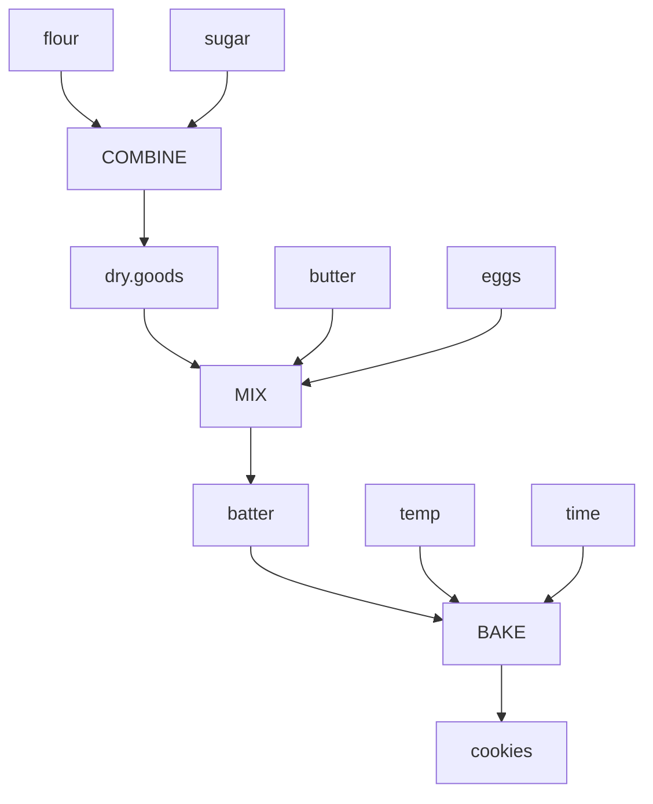
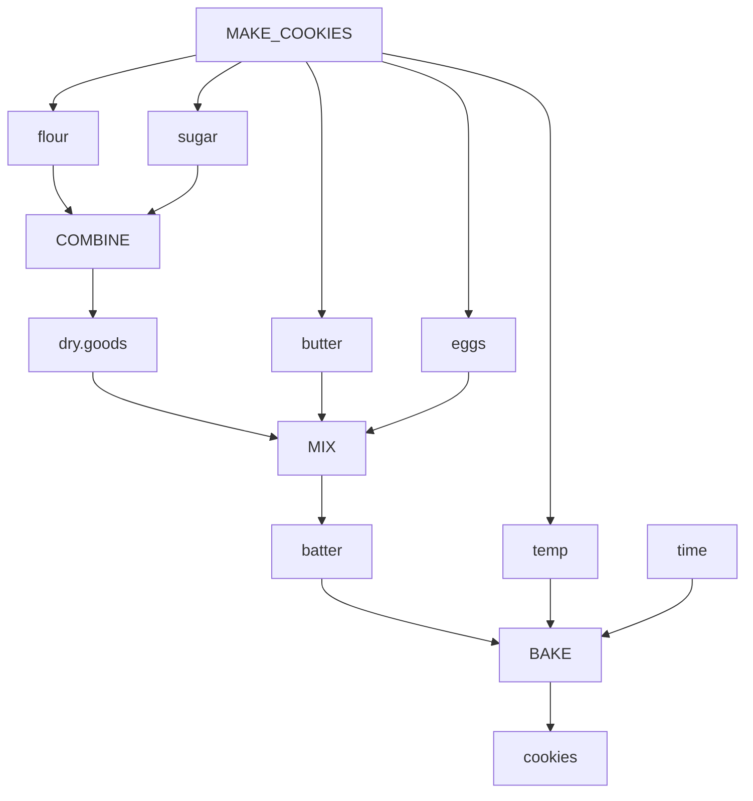
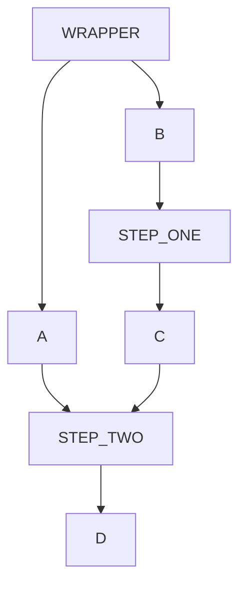
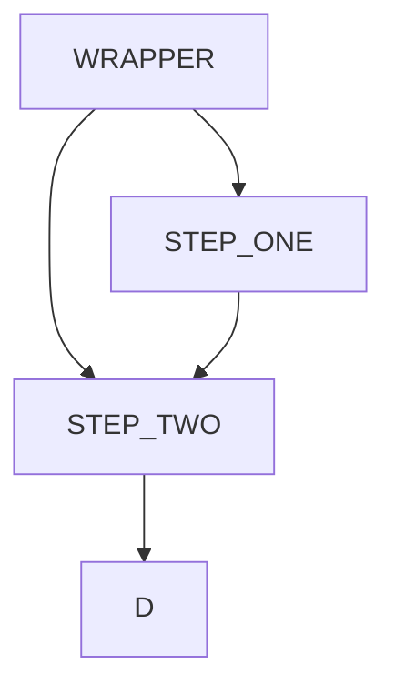

<div class = "uk-container uk-container-small">

<br>
<br>


# Week 03

-----------------------

* TOC
{:toc}

-----------------------

<br>
  
## Diagramming a Workflow

We often want to break a very long script into a more manageable workflow by grouping chunks of your code into functions that represent discrete steps in the process. This also makes the program more flexible because you only have to change a couple of inputs in order to run an new "recipe". 

```r
make_cookies <- function( butter=0.33, sugar=0.5, eggs=1, flour=2, temp=375 )
{
   dry.goods <- combine( flour, sugar )
   batter <- mix( dry.goods, butter, eggs )
   cookies <- bake( batter, temp, time=10 )
   return( cookies )
}
```

For a workflow to function properly, though, you need to pay close attention to the inputs and outputs. One way to visualize this clearly is to diagram your arguments. Start by breaking open the function then diagram all of the steps. Note I am writing functions in UPPERCASE and objects (arguments) in lowercase for clarity. 

```r
# make_cookies <- function( butter=0.33, sugar=0.5, eggs=1, flour=2, temp=375 )
# {

butter <- 0.33
sugar <- 0.5
eggs <- 1
flour <- 2
temp <- 375

dry.goods <- combine( flour, sugar )
batter    <- mix( dry.goods, butter, eggs )
cookies   <- bake( batter, temp, time=10 )

#    return( cookies )
# }
```



Then add the wrapper function by listing it as the source node for all of the arguments passed to the wrapper. This way you can ensure that all arguments are flowing through the workflow properly by checking two things: 

1. There are no loops in the diagram.
2. Any argument that does not come from MAKE_COOKIES (your wrapper) have default values provided.



We can see that the **time** variable used in **BAKE()** is not an argument passed to **MAKE_COOKIES()**, so the value needs to be provided as a default or defined inside the function somewhere. We can see that we have hard-coded the **time** value into the **BAKE()** function here: 

```r
bake( batter, temp, time=10 )
```

Which is fine if every recipe can use the same bake time. Otherwise we would want to pass that argument to the wrapper function as well. 

These diagrams can be made on GitHub using a **mermaid** code chunk: 

````

````

It is identical in the R Markdown context, except you need to call the **mermaid()** function from the **DiagrammeR** package. 

````
```{r}
library(DiagrammeR)

mermaid("
graph LR
    A --> B;
")

```
````

### Q1: Diagram Part-01 of Lab-02

Diagram the workflow of the play_game() function in Part-01 of Lab-02. Use UPPERCASE for function names and lowercase for argument names. Then answer the following: 

**PART A:** How many objects are passed to play_game(), and how many originate from functions? 

**PART B:** Add game.size, i.e. the number of doors, as an explicit argument in the diagram.

**PART C:** Make sure you represent **PLAY_GAME()** on your diagram. If it does not receive arguments nor pass them, where would it go? 

Share a screen shot of your diagram of the workflow on YellowDig with an explanation of parts A-C. 

### Q2: Diagram Part-02 of Lab-02

Diagram the workflow of the play_game() function in **Part-02** of Lab-02, then answer the following: 

**PART A:** How many objects are passed to play_game(), and how many originate from functions? 

**PART B:** How is game.size present in your diagram now? 

**Part C:** Compare the Q1 and Q2 diagrams. How did the workflow change?  

Share a screen shot of your diagrams of the workflows on YellowDig with an explanation of parts A-C. 


### Q3: Diagram Function Dependencies 

You initial workflow diagrams represent the relationship between functions and the objects needed for the functions to run. Create a simplified version of the graph that represents dependencies between functions. Two functions are connected if the output of one function is an input of another function. For example, a simple function **wrapper( A, B )** that passes arguments to two steps might look like: 



And after removing the arguments the function dependency would look like: 



**PART-A:** Diagram the function dependencies in **Part-01** and **Part-02** on LAB-02. How do they change as a result of generalizing the game setup? 

<br>
<hr>
<br>


## Regular Expressions

The function **grep( pattern, string )** works as follows:

> Search for the **pattern** in each **string** in the character vector. 

*Recall a string is a value that is comprised of some combinations of text, punctuation, numbers, and spaces. It can be a single letter, a single word, a jumble of letters like a password, a sentence, or a paragraph. Typically we refer to words as strings (look back at the baby name bracelet metaphor in the lecture notes). Computers don't understand language, so text to them is just a bunch of letters strung together in some particular order. When doing analysis with numbers we focus on size and proportions. When doing analysis with text we focus on sets and orders of letters. For example, when two letters are transposed it creates a new word or represents an error in spelling. The order of words in a sentence is what generates meaning. A lot of text analysis entails learning how to decompose sentences and paragraphs into words, cleaning and standardizing the words by removing punctuation and conjugation ("stemming"), and then tabulating occurances or looking for patterns. Mastering a few basic text analysis functions like string splits and pattern search move you quickly along the path to becoming an expert text analyst.* 

The search pattern in each case below represents a regular expression. The vector **strings** is a character vector that contains multiple strings.

Note: GREP = _global regular expression print_. It is a regular expression convention, which is not specific to R. Most programming languages allow you to use regular expression syntax to search for patterns in data. 

```r
grep( pattern, x, ignore.case=FALSE, value=FALSE )
```

By default grep() returns the **position** of a match in the vector. Add **value=TRUE** to return the actual string. 

**grepl()** stands for grep LOGICAL, and returns a vector of TRUE / FALSE indicating matches. Note that the lenth of the return vector will be the number of matches in **grep()** and it will be the same length as x when using **grepl()**. 

Before running the code, review the regular expression operators and see if you can guess which values will match each search parameter below. 

For a full list of operators review this basic [cheat sheet](https://github.com/DS4PS/cpp-527-spr-2020/raw/master/lectures/regular-expressions%20one-page-cheat-sheet.pdf) and [Regular Expressions as used in R](https://stat.ethz.ch/R-manual/R-devel/library/base/html/regex.html#:~:text=Two%20types%20of%20regular%20expressions,use%20a%20literal%20regular%20expression.):

*The fundamental building blocks are the regular expressions that match a single character. Most characters, including all letters and digits, are regular expressions that match themselves. Any metacharacter with special meaning may be quoted by preceding it with a backslash (or double-backslash in windows).*

**WARM-UP:** 
  
How many can your guess correctly before you run the code? 

```r

strings <- c("through","rough","thorough","throw","though","true","threw","thought","thru","trough")

# what will the following return? 

grep( pattern="th?rough", strings, value = TRUE)

grep( pattern=".ough", strings, value = TRUE)

grep( pattern="^.ough", strings, value = TRUE)

grep( pattern="ough.", strings, value = TRUE)

# note the difference between ordered text and sets of text

grep( pattern="ough", strings, value = TRUE)  # letter order matters

grep( pattern="[ough]", strings, value = TRUE) # unordered set

# sets operators are inclusive:  o OR u OR g OR h 

grep( pattern="[ough]", strings, value = TRUE) # compare results to

grep( pattern="[tough]", strings, value = TRUE) # doesn't have to include t

# ^ operator changes meaning inside of sets

grep( pattern="^rough", strings, value = TRUE) # anchor

grep( pattern="[^r]ough", strings, value = TRUE) # absence of

grep( pattern="[^ou]", strings, value = TRUE) # exclude both

grep( pattern="[^uo]", strings, value = TRUE) # does order matter in sets? 

# these are not as useful

grep( pattern="tr*", strings, value = TRUE)

grep( pattern="t*o", strings, value = TRUE)
```

<br>
<br>


### Q1 - Constructing Factors

Building on the lab from this week, we constructed groups of titles using the following code logic:  

```r
group.questions <- grepl( "//?$", titles )

# OR 

group.who <- grepl( "^Who", titles )
group.what <- grepl( "^What", titles )
group.where <- grepl( "^Where", titles )

group.www <- group.who | group.what | group.where 
```

What if we wanted to build a single factor that has distinct levels for all of our groups? Note that you would need to define MUTUALLY EXCLUSIVE groups in order for this to make sense. If the groups are not mutually exclusive (one title could belong to multiple groups) then it would not make sense to combine them into a single factor. 

```r
group.01 <- grepl( ..., titles )  # questions
group.02 <- grepl( ..., titles )  # colons 
group.03 <- grepl( ..., titles )  # power lists

# create factor f where each level represents a different kind of title
# and include an "other" category for those that don't fit into above groups
```


### Q2: RegEx Substring Application

We have an large database where all of the addresses and geographic coordinates are stored as follows:

```r
x <- c("100 LANGDON ST
MADISON, WI
(43.07794869500003, -89.39083342499998)", "00 N STOUGHTON RD E WASHINGTON AVE
MADISON, WI
(43.072951239000076, -89.38668964199996)")
```

Using Base R functions (not the stringr package), write a function that accepts the address vector **x** as the input, and returns a vector of numeric coordinates.

Note that the length of addresses can change, so you will need to use regular expressions (instead of just a substr() function) to generate proper results. 


## Q3: Greedy vs Reluctant Search 

When applying quantifiers to search strings, especially those using wildcards, pay attention to the difference between "greedy" and "reluctant" matches. 

**Greedy search** tries to find the biggest string possible that matches the expression. 

**Reluctant search** tries to find the smallest string possible that matches the expression. 


[**Example: From A to Z (quoted directly from StackOverflow)**](https://stackoverflow.com/questions/3075130/what-is-the-difference-between-and-regular-expressions)

Let's compare these two patterns: `A.*Z` and `A.*?Z`.

Given the following input:

```
eeeAiiZuuuuAoooZeeee
```

The patterns yield the following matches:


`A.*Z` yields 1 match: `AiiZuuuuAoooZ`  

`A.*?Z` yields 2 matches: `AiiZ and AoooZ` 

Let's first focus on what `A.*Z` does. When it matched the first `A`, the `.*`, being greedy, first tries to match as many `.` as possible. In order to do this, once encountering an `A.*` (A followed by any other characters 0 or more times) the algorithm jumps to the end of the string and scans backwards, looking for anything that matches `Z`:

```
eeeAiiZuuuuAoooZeeee
   \_______________/
    A.* matched, Z can't match
```

Since the `Z` doesn't match, the engine backtracks, and `.*` must then match one fewer `.`:

```
eeeAiiZuuuuAoooZeeee
   \______________/
    A.* matched, Z still can't match
```

This happens a few more times, until finally we come to this:

```
eeeAiiZuuuuAoooZeeee
   \__________/
    A.* matched, Z can now match
```

Now `Z` can match, so the overall pattern matches:

```
eeeAiiZuuuuAoooZeeee
   \___________/
    A.*Z matched
```

By contrast, the reluctant repetition in `A.*?Z` first matches as few `.` as possible, and then taking more `.` as necessary. It would iteratively look for the following: 

* `AZ` 
* `A.Z` 
* `A..Z` 
* `A...Z` 

Until `A. ... .Z` it reaches the full string length. This explains why it finds two matches in the input.


```
eeeAiiZuuuuAoooZeeee
   \__/    \___/ 
   A..Z    A...Z
```

Here's a visual representation of what the two patterns matched:

```
eeeAiiZuuuuAoooZeeee
   \__/r   \___/r      r = reluctant
    \____g____/        g = greedy
```


For more control over matches using greedy versus reluctant search see: 

[**Quantifier Cheat Sheet**](https://www.rexegg.com/regex-quantifiers.html#cheat_sheet)


**QUESTION Q3:**

Consider this new string: 

```
eeeAiiZuuuuAoooZeeee    # original string
eeeAiAiZuuuuAoZooZeeee  # new string
```

**Given what you learned above, what would the following return and why? Explain the reason this happens by describing the "recipe" of the search algorithm in plain English or with pseudocode.**

```r
# str_match_all() returns substring

x <- "eeeAiAiZuuuuAoZooZeeee"
stringr::str_match_all( x, "A.*?Z" )
```

Here are all of the possible matches: 


```
eeeAiAiZuuuuAoZooZeeee
   \___/
   
eeeAiAiZuuuuAoZooZeeee
     \_/
     
eeeAiAiZuuuuAoZooZeeee
            \_/
            
eeeAiAiZuuuuAoZooZeeee
            \____/
   
eeeAiAiZuuuuAoZooZeeee
     \________/

eeeAiAiZuuuuAoZooZeeee
     \___________/
     
eeeAiAiZuuuuAoZooZeeee
   \__________/
   
eeeAiAiZuuuuAoZooZeeee
   \_____________/
```


  
<br>
<hr>
<br>


**MORE PRACTICE:** 
  
* create regular expression to search for email address
* create regular expression to search for social media handles (@xxx)  
* search for dates XX-XX-XXXX; XXXX-XX-XX; jan-xx; Dec xx, xxxx;
* CHALLENGE: read dates in combination of M-D-Y format then determine which is which (only 12 months, only 31 days)
* search for proper nouns (capitalization, not at start of the sentence) 
* name parsing to guess first, middle, last names


</div>
 
<style>
em {
    color: black;
} 
  
h1{
  font-size:calc(2em + 0.25vw) !important;
  margin-top:160px !important;
  margin-bottom:20px;
  } 
  
h2{
  font-size:calc(2em + 0.25vw) !important;
  font-weight:300;
  margin-top:80px !important;
  margin-bottom:20px;
  } 

h3{
  font-size:calc(1.4em + 0.25vw);
  font-weight:300;
  margin-top:40px !important;
  margin-bottom:10px;} 
   

ul a:hover {
  color: #337ab7;
  text-decoration: none;
  font-weight: normal;
} 

#markdown-toc ul {
  font-size:calc(0.85em + 0.25vw);
  line-height:1.2;
  font-weight: bold;
} 
#markdown-toc ul li {
  list-style-type: disc !important;
  font-size:calc(0.65em + 0.25vw);
  line-height:1.2;
  margin-left: 20px;
}  
#markdown-toc a {
  color: black;
  font-size:calc(0.65em + 0.25vw);
  line-height:1.2;
  font-weight: normal;
}  
#markdown-toc a:hover {
    color: black;
    text-decoration: none;
    font-weight: bold;
}

</style>
